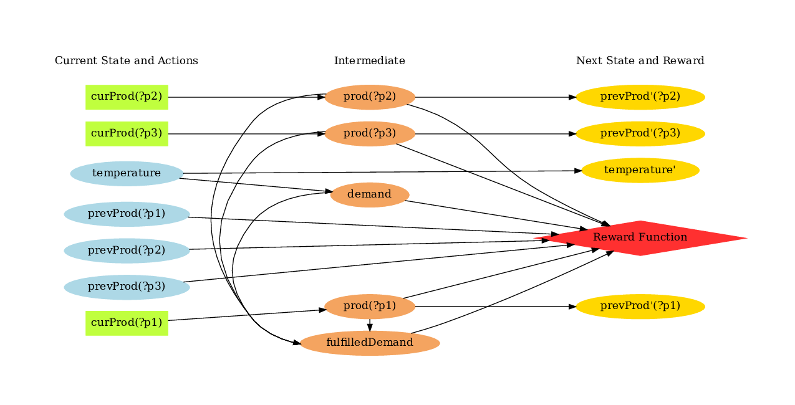

<p style="font-size:25px;text-align:left"><b>Visualizing DBNs (Dynamic Bayes Nets) with XADD</b></p>

With the [XADD compilation](/xadd.md) of a given domain instance, you can easily visualize the dependencies between different fluents.  For this purpose, you can use the provided visualization tool that gives you a way to produce diagrams similar to an influence diagram.

Specifically, you can use the `pyRDDLGym/Visualizer/visualize_dbn.py` file. In this page, we will take you through how to use this file for nicely visualizing a RDDL domain instance.

To begin with, you need to install the following:

1. graphviz
2. pygraphviz
3. xaddpy

Make sure you have activate the right conda environment with `conda activate YOUR_CONDA_ENVIRONMENT`. Now, we give a step-by-step guide to installing the necessary packages.

### Step 1: Installing graphviz

1. For Ubuntu/Debian users, run the following command.

```shell
sudo apt-get install graphviz graphviz-dev
```

2. For Fedora and Red Hat systems, you can do as follows.

```shell
sudo dnf install graphviz graphviz-devel
```

3. For Mac users, you can use `brew` to install `graphviz`.

```shell
brew install graphviz
```

Unfortunately, we do not provide support for Windows systems, though you can refer to the [pygraphviz documentation](https://pygraphviz.github.io/documentation/stable/install.html) for information.

### Step 2: Installing pygraphviz

1. Linux systems

```shell
pip install pygraphviz
```

2. MacOS

```shell
python -m pip install \
    --global-option=build_ext \
    --global-option="-I$(brew --prefix graphviz)/include/" \
    --global-option="-L$(brew --prefix graphviz)/lib/" \
    pygraphviz
```

Note that due to the default installation location by `brew`, you need to provide some additional options for `pip` installation.

### Step 3: Installing xaddpy

XADD (eXtended Algebraic Decision Diagram) [Sanner at al., 2011] enables compact representation and operations with symbolic variables and functions. In fact, the data structure can be used to represent CPFs defined in a RDDL domain once it is grounded for a specific RDDL instance.
You can find more detailed description of the XADD compilation step in [this page](/xadd.md). 

We use the [xaddpy](https://github.com/jihwan-jeong/xaddpy) package that provides a Pure Python implementation of XADD (originally implemented in Java). To install the package, simply run the following:

```shell
pip install xaddpy
```

## Visualizing DBNs with XADD

With the necessary tools being installed, we can now go ahead and draw DBN diagrams of various RDDL domain/instances. As a running example, we show how you can visualize a [Wildfire](/wildfire.md) instance as defined in [pyRDDLGym/Examples/Wildfire](https://github.com/ataitler/pyRDDLGym/tree/main/pyRDDLGym/Examples/Wildfire). 

### Instantiate RDDL2Graph object

Firstly, you can instantiate a `RDDL2Graph` object by specifying the domain, instance, and some other parameters.

```python
from pyRDDLGym.Visualizer.visualize_dbn import RDDL2Graph

r2g = RDDL2Graph(
    domain='Wildfire',
    instance=0,
    directed=True,
    strict_grouping=True,
)
```

Then, you can visualize the corresponding DBN by calling 

```python
r2g.save_dbn(file_name='Wildfire')
```
which will save a file named `Wildfire_inst_0.pdf` to `./tmp/Wildfire`. Additionally, you can check the `Wildfire_inst_0.txt` file which records grounded fluent names and their parents in the DBN. 

The output of the function call looks like [this](/images/Wildfire_inst_0.pdf) (opens a new tab showing the PDF file, which we omit to include here since it would take up quite some space).

You can also specify a single fluent and/or a ground fluent that you are interested in for visualization. For example,

```python
r2g.save_dbn(file_name='Wildfire', fluent='burning', gfluent='x1_y1')
```
will output the following graph.

")

huh, Nice! You can see from this diagram that the next state transition of the burning state at (x1, y1) only depends on 6 grounded variables (i.e., whether neighboring cells are burning; whether this location is out of fuel; whether the put-out action has been taken). 


To give you a taste of another example, here's the DBN visualization of the [Power Generation instance](https://github.com/ataitler/pyRDDLGym/tree/main/pyRDDLGym/Examples/Power_gen), in which intermediate variables are placed in the middle column:



<hr>
[Back to main page](index.md)
