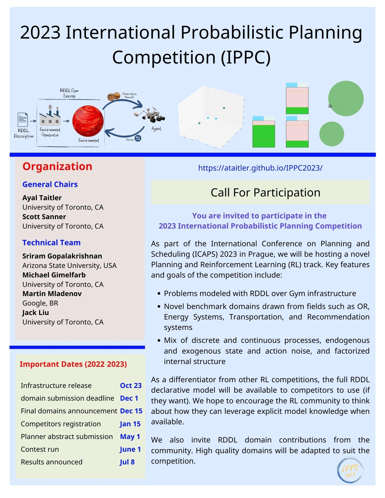

<b>Welcome to the 2023 International</b>

<b>Probabilistic Planning Competition</b>

The International Probabilistic Planning Competition is organized in the context of the International Conference on Planning and Scheduling (ICAPS). It empirically evaluates state-of-the-art planning systems on a number of benchmark problems. The goals of the IPC are to promote planning research, highlight challenges in the planning community and provide new and interesting problems as benchmarks for future research.

Since 2004, probabilistic tracks have been part of the IPC under different names (as the International Probabilistic Planning competition or as part of the uncertainty tracks). After 2004, 2006, 2008, 2011, 2014, and 2018, the 7th IPPC will be held in 2023 and conclude together with ICAPS, in July 2023, in Prague (Czech Republic). This time it is organized by Ayal Taitler and Scott Sanner.

## Calls
Please forward the following calls to all interested parties:
- [Call for Participation and Domains](/call_email.md)

  

## Preliminary Schedule

| Event                                         | Date             |
|:----------------------------------------------|:-----------------|
| Infrastructure release with sample domains    | October, 2022    |
| Call for domains and praticipants             | October, 2022    |
| Final domains announcement                    | December, 2022   |
| Competitors registration                      | January, 2023    |
| Planner abstract dubmission                   | May, 2023        |
| Contest run                                   | June, 2023       |
| Results announced                             | July, 2023       |

## Setup

This year's competition will be using the generic pyRDDLGym - an autogeneration tool for gym environments from RDDL textual description.

More information about the infrastructure, how to use it and how to add user defined domains can be found the following short guide

- [Infrastructure guide](/infrastructure.md)

## Domains

There are several original domains at the time of the competition call, but more domains will be added, and we strongly encourage the community to create and contribute used defined domains in you field of expertise, or any problem you think the community should try to solve. The highest quality community contributed domains will be selected to be part of the competition's domains. We are aware that participants that submit a domain that is used have some advantage with respect to performance on that domain. We view this as a good incentive for teams to submit high quality proposals.

  

        <a href="wildfire.html">
        
        
Fire Fighting (from tutorial)

        </a>
    

    

        <a href="rover.html">
        
        
Mars Rovers Science Mission

        </a>
    

    

        <a href="recsim.html">
        
        
Recommendation Systems

        </a>
    

    

        <a href="powergen.html">
        
        
Power Unit Commitment

        </a>
    

    

        <a href="uav.html">
        
        
UAV

        </a>
    

    

        <a href="elevator.html">
        
        
Elevator Control

        </a>
    

 

In addition to the original domain, we have recreated some of the classical control domains in RDDL. Illustrating how easy it is to generate domains in pyRDDLSim:

    

        <a href="cartpole.html">
        
        
Cart Pole

        </a>
    

    

        <a href="mountaincar.html">
        
        
Mountain Car

        </a>
    

 

Note, that there are additional domains out there from past competitions (IPPC 2011, IPPC 2014), which can be also be used with pyRDDLSim:
- [IPPC 2011 domains](https://github.com/ssanner/rddlsim/tree/master/files/final_comp/rddl): This repository contains 8 domains: Elevators, Cross Traffic (Frogger), Game of Life, Navigation, Reconnaissance, Skill Teaching, SysAdmin, Traffic. 
- [IPPC 2014 domains](https://github.com/ssanner/rddlsim/tree/master/files/final_comp_2014/rddl): This repository contains some of IPPC 2011 domains, with additional 4 new domains: Tamarisk (Invasive Species), Wildfire (Firefighting), Academic Advising, Triangle Tireword.

Past compeition were entirely discrete and as the focus of this year is continous and mix discrete-continous problems, their domains were not included in the pyRDDLGym repository. However everybody are welcome to take advantage of their existence. Just make sure they do not make use of something outside of pyRDDLGym RDDL subset. In that case the original [Java simulator](https://github.com/ssanner/rddlsim) can be used.

## Evaluation
The exact details of the evaluation process are still in discussions (in order to be able to accomodate planing and learning approaches), but the general lines will follow the evaluation of the past [IPPC 2011](http://users.cecs.anu.edu.au/~ssanner/IPPC_2011/index.html) competition. 

Domains (note numbers might change this year)
- 8 domains
- 10 instances per domain
- 30 trials per instance

Procedure
- We will use a cloud computing resources, where every team will gain access to an identical computer. The exact configuration will be published enough time before the competition, and an early access will be possible in order to test the code and know what to expect.
- At competition time
    - You will receive instructions on how to login to your own personal Linux node.
    - The location of all RDDL domains / instances.
    - Your agent will have 24 hours to complete trials for all instances.
        - Instances will have a suffix "_1" up to "_10" where 1 will be the smallest (usually easiest) and 10 the largest (usually hardest).
        - You need not compete on all instances or for all trials, in that case the best average score from the random and NOOP policies is assigned (see below).
- Post-competition evaluation
    - We will shutdown the server at the 24 hour time limit.
    - The server maintains a log file for all instances and trials you complete.
    - If you execute more than 30 trials per instance, we will only use data for the last 30 trials.
    - Overall planner evaluation criterion for ranking.
        - For each instance trial, the server records a raw score.
            - For the final competition (boolean MDP and POMDP tracks), a fixed horizon of 40 will be used for all instances.
    - We will compute a [0,1] normalized average score per instance from raw score.
        - Per instance, averaged over all 30 trials, we will determine.
            - The minimum average score (minS_{instance}) is the max over the average scores from a purely random policy and an always-noop policy.
            - The maximum average score (maxS_{instance}) is the max over all competitors, a purely random policy, and a pure noop policy.
            - If a planner does not compete a trial for an instance, minS_{instance} is assigned as the raw score for that missing trial.
            - We will make available all raw and normalized data as well as minS_{instance} and maxS_{instance} used to compute the normalized score for each instance.
        - Normalized-score_{planner,instance} = max(0, [(sum_{trials 1..30} raw-score_{planner,instance,trial})/30 - minS_{instance}] / [(maxS_{instance} - minS_{instance})] ).
        - We use a max here in the unlikely event that a planner does worse than either the noop or random policies to ensure the minimum score is 0... we don't want to penalize a planner that tries and fails vs. a planner that simply skips an instance and gets 0 automatically.
    - Final agent evaluation criterion
        - avg-norm-score_{planner} = (sum_{instance 1..80} normalized-score_{planner,instance}) / 80.
        - Note 1: 80 instances are from 8 domains X 10 instances per domain (instance names uniquely determine the domain).
        - Note 2: given the normalized score per instance, it is to your advantage to complete easier instances before harder ones.
    - Min / max score:
        - The minimum avg-norm-score for any competing planner is 0.
        - The maximum avg-norm-score for any competing planner is 1.
        - Agents will be ranked by their avg-norm-score.

## Registration
At this point just join the google group (see link at the bottom) and announce your interest to compete in a post that includes your tentative team name, organization, and team members.

## Organizers
- [Ayal Taitler](https://sites.google.com/view/ataitler/home) (University of Toronto, CA)
- [Scott Sanner](https://www.mie.utoronto.ca/faculty_staff/sanner/) (University of Toronto, CA)

## Contributors
- [Michael Gimelfarb](https://mike-gimelfarb.github.io/) (University of Toronto, CA)
- [Sriram Gopalakrishnan](https://marirsg2.github.io/Sriram_Unravel/) (Arizona State University/J.P. Morgan, USA)
- [Martin Mladenov](https://ataitler.github.io/IPPC2023/) (Google, BR)
- [Jack Liu](https://ataitler.github.io/IPPC2023/) (University of Toronto, CA)

Contact us: [ippc2023-rddl@googlegroups.com](https://groups.google.com/g/ippc2023-rddl)
