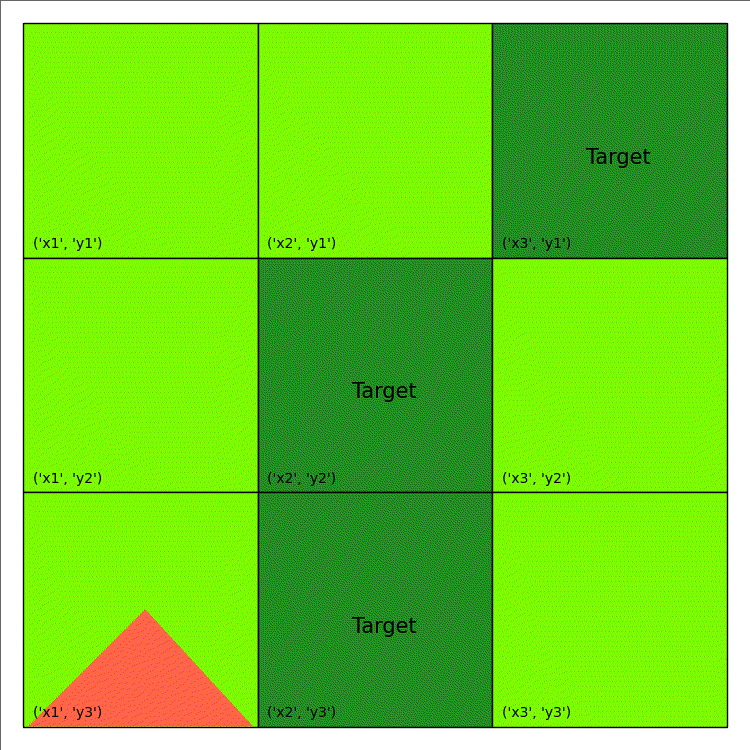
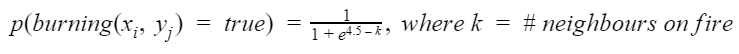
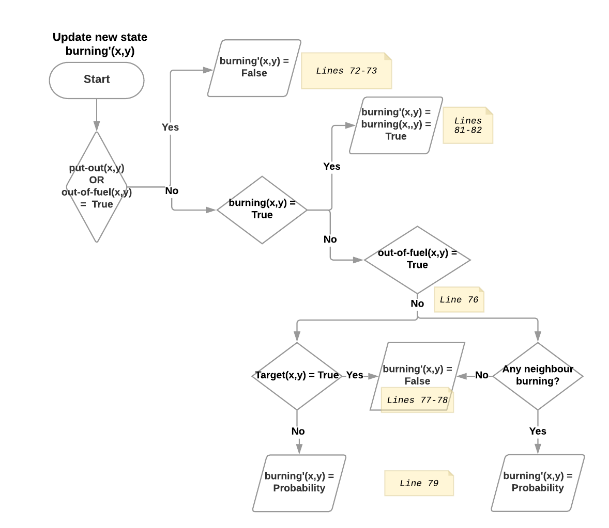
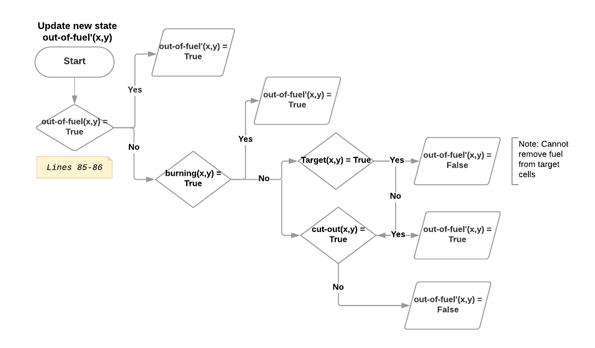
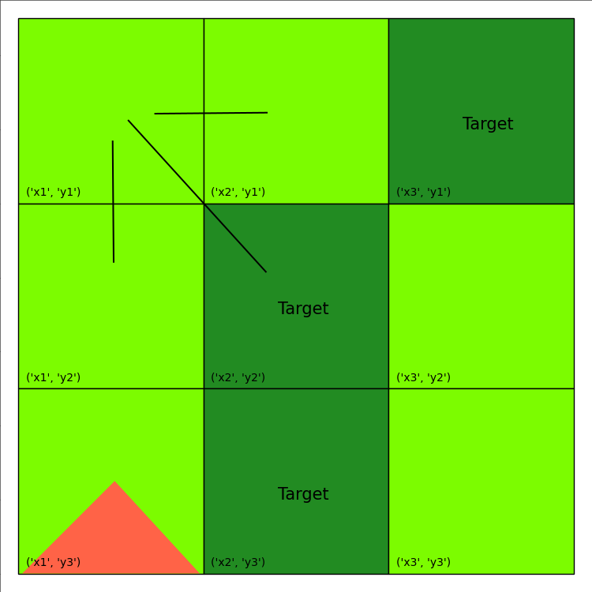

<p style="font-size:30px;text-align:center"><b>Fighting Wildfires: RDDL Tutorial with RDDLGym</b></p>

## 1.0 An Overview of RDDL
The Relational Dynamic Influence Diagram Language (RDDL) is a uniform language where states, actions, and observations (whether discrete or continuous) are parameterized variables and the evolution of a fully or partially observed (stochastic) process is specified via (stochastic) functions over next state variables conditioned on current state and action variables.  An objective function measures the immediate effects of the state, actions, and observation variables, and should be optimized over time for optimal control. To solidify this definition, we will begin our discussion with an example.

<div style="width:100%;text-align:center;">
  <a href="images/tutorial/wildfirespread2.gif">
    
  </a>
</div>

Imagine that you are an emergency manager tasked to control a wildfire, as depicted in the animation on the right, and ultimately keep it away from important target locations, such as schools or residential houses. Consider that each cell on the map can either be burning (flame), out-of-fuel (gray), or neither (green)  and you have the ability to both cut-out fuel from a non-target cell (causing it to be out-of-fuel and preventing it from igniting in the future) and put-out the fire occupying a burning cell. Cells are more likely to ignite as the number of their burning neighbouring cells increases, as specified by the following function:

<div style="width:100%;text-align:center;">
  <a href="images/tutorial/eq1.png">
    
  </a>
</div>

Using RDDL, we can easily model state transitions in this stochastic process for any size grid or connected topology of locations as shown below as if we were simply writing functions for a stochastic simulator for the problem (subsequent sections will explain this syntax in detail but the comments should help your initial understanding):


```
cpfs {   

 // Specify the probability that a cell is burning in the next time step (') 

    burning'(?x, ?y) = 

        // Stops burning if put out or has no fuel

        if ( put-out(?x, ?y) | out-of-fuel(?x,?y)) then false

        // Ignition of new fire can only occur if the cell is not (~) out-of-fuel 

        else if (~out-of-fuel(?x, ?y) ^ ~burning(?x, ?y)) 

            // Targets can only begin to burn if at least one neighbour is burning
            then [if (TARGET(?x, ?y) ^ ~exists_{?x2: x-pos, ?y2: y-pos}(NEIGHBOR(?x, ?y, ?x2, ?y2) ^ burning(?x2, ?y2))) then false

            // Else, use probability function to determine if a cell begins to burn 
            // (when summed, logic expressions take value true=1, false=0)
            else Bernoulli( 1.0 / (1.0 + exp[4.5 - (sum_{?x2: x-pos, ?y2: y-pos} (NEIGHBOR(?x, ?y, ?x2, ?y2) ^ burning(?x2, ?y2)))]))]
     else burning(?x, ?y); // State persists     

    // Specify the probability that a cell is out of fuel in the next time step (')
    out-of-fuel'(?x, ?y) = out-of-fuel(?x, ?y) | burning(?x,?y) | (~TARGET(?x, ?y) ^ cut-out(?x, ?y));      

 };

```
While the above transition specification may seem complex, imagine writing down the state transition by hand for a Wildfire domain with grid size 100 X 100.  With RDDL and it's relational specification, you only have to write down the specification for a single cell (?x,?y) and then a compiler will take care of "grounding" the problem for any grid size.  While PPDDL also provides a relational language for specifying stochastic transitions, we note that it cannot express the above stochastic transition for Wildfire due to
1. concurrent actions (note that we can put-out any number of burning cells simultaneously),
2. independent exogenous stochastic events (all cells may ignite independently of other cells), and
3. complex transition probability specifications (in this case the probability depends on an exponential sigmoidal transform of a sum of logical state properties).

RDDL vs. PPDDL remark: While RDDL can express all PPDDL domains, but not vice versa as noted for points (1)-(3) above, there are some domains where PPDDL notation is more compact and convenient.  See the comments in the RDDL version of the Triangle Tireworld domain for discussion of one particular example where this is true.

We have specified the state transition function above, but we have not specified the reward that will guide our choice of actions.  In the following, we define an objective function to specify the immediate reward at every time step. Costs are incurred for performing both the put-out and cut-out actions. Additionally, penalties for every target and non-target cell burning at every time-step are also incurred. Thus, our ultimate objective is the minimize the total costs and penalties incurred. This can be specified using RDDL as, 

```
reward =  

        // Pay a cost for every cell that is cut-out (constant COST-CUTOUT defined in full RDDL spec below)
          [sum_{?x: x-pos, ?y: y-pos} [ COST-CUTOUT*cut-out(?x, ?y) ]] 

        // Pay a cost for every cell that is put-out (constant COST-PUTOUT defined in full RDDL spec below)
        + [sum_{?x: x-pos, ?y: y-pos} [ COST-PUTOUT*put-out(?x, ?y) ]]

        // Pay a cost for every target cell that is burnt (constant PENALTY-TARGET-BURN defined in full RDDL spec below)
        // NOTE: if a target is out-of-fuel, it was burnt so still penalize (since it could not have been cut-out)
        + [sum_{?x: x-pos, ?y: y-pos} [ PENALTY-TARGET-BURN*[ (burning(?x, ?y) | out-of-fuel(?x, ?y)) ^ TARGET(?x, ?y) ]]] 

        // Pay a smaller cost for every non-target cell that is burnt (constant PENALTY-NONTARGET-BURN defined in full RDDL spec below)
        + [sum_{?x: x-pos, ?y: y-pos} [ PENALTY-NONTARGET-BURN*[ burning(?x, ?y) ^ ~TARGET(?x, ?y) ]]];
```
These are the core components of RDDL in a nutshell!  For completeness, the remainder of this documentation will provide a detailed walk-through of the process of formulating, debugging, and optimizing the wildfire problem introduced above using RDDL.  Following this we will provide links for using the PROST planner to automatically plan for the best actions in the Wildfire domain given a starting state. 

## 2.0 Wildfire Domain Full Tutorial
This section will outline the full file structure and syntax required to model the wildfire problem. The reader is encouraged to refer to the RDDL language description page for more details on any of the various blocks, functions, or types used in this tutorial. This section will outline the full file structure and syntax required to model the wildfire problem. The reader is encouraged to refer to the RDDL language description page for more details on any of the various blocks, functions, or types used in this tutorial. 

## 2.1 Getting Set Up with RDDL
Before we dive into dissecting this problem, the first course of action is to install and compile RDDL. 

First, clone (or download the zip file and unzip) the pyRDDLGym GitHub repository found at https://github.com/ataitler/pyRDDLGym. Open a terminal in the pyRDDLGym directory, or ensure that your current working directory is pyRDDLGym. **Throughout the course of this tutorial, as well as during any future RDDL usage, ensure that you are always working within the pyRDDLGym directory.**

Next, we must install the requiremented packages for pyRDDLGym using the following command

```
$ pip install -r requirements.txt
```
Alternatively you can install pyRDDLGym using pip:
```
$ pip install pyRDDLGym
```
PyRDDLGYm follows closely to the gym interfaces. Below is an example of running wildfire domain using an random agent.
```
from pyRDDLGym import RDDLEnv
from pyRDDLGym import ExampleManager
from pyRDDLGym.Policies.Agents import RandomAgent

ENV = 'Wildfire'

# get the environment infos
EnvInfo = ExampleManager.GetEnvInfo(ENV)

# set up the environment class, choose instance 0 because every example has at least one example instance
myEnv = RDDLEnv.RDDLEnv(domain=EnvInfo.get_domain(), instance=EnvInfo.get_instance(0))
# set up the environment visualizer
myEnv.set_visualizer(EnvInfo.get_visualizer())
# set up an example aget
agent = RandomAgent(action_space=myEnv.action_space, num_actions=myEnv.NumConcurrentActions)

total_reward = 0
state = myEnv.reset()

for step in range(myEnv.horizon):
    myEnv.render()
    action = agent.sample_action()
    next_state, reward, done, info = myEnv.step(action)
    total_reward += reward
    state = next_state
    if done:
        break

print("episode ended with reward {}".format(total_reward))  
myEnv.close()
```


## 2.2 Problem Decomposition (Optional)
This problem, like many other problems modelled using RDDL, is a Markov Decision Process (MDP).  Thus, before we begin to formulate this in RDDL, it is helpful to first decompose the problem into the components of an MDP. Each MDP consists of five components: states (S), actions (A), transition model (T), immediate reward (R), and discount factor (𝛾). 

**States (S)**: is a summary of all available information needed in order to determine the next state. In this wildfire example, two states are required for each cell to assess the scenario, either a cell is burning, or it is out-of-fuel.  Both of them are of type boolean, True or False, taking arguments of the (x, y) coordinates of the cell.  In the MDP literature, representing the state with state variables is known as a factored MDP.  Note that the if we have a 10 X 10 grid, then we have 100 cells each represented by two boolean state variables, leading to a total of 2<sup>200</sup> possible states!  

RDDL notation remark: As a convention in notation, if the current state is S, the new state will be denoted by a prime/ apostrophe [’], being S’.

**Actions (A)**: defines what can be done on a particular state. In this case, the firefighters can perform two actions, **put-out** or **cut-out**, at position **(x-pos, y-pos)**. Both of the actions are designed to be deterministic such that one action specifies and assures a certain transition to a new state. Put-out means to stop the fire at this location, thus when put-out action is performed, this location is no longer burning, **put-out(x,y)** = True **⇒burning’(x,y)** = False. Cut-out removes the combustible material (i.e. fuel) from the current cell to make it out of fuel, **put-out(x,y)** = True ⇒ **out-of-fuel’(x,y)** = True.

**Transition Model (T)**: specifies the probability to enter a new state s' based on the current state(s) or when a stochastic action a is performed on the current state(s) s, P(s'|s,a). In the Wildfire example, the probability of a certain cell to burn is defined by the probability function outlined in Section 1.0, varying based on the number of current neighbours on fire.  Note that we define the transition probability of each next state fluent (e.g., burning’(x,y) or out-of-fuel’(x,y)) as an independent probabilistic function of current state properties.  

RDDL correlated effects remark: One of the most common questions for RDDL is how to model state transitions where two or more fluents depend on a common probabilistic outcome (i.e., how do we model correlated effects)?  The quick answer is that one should use intermediate fluents to model a probabilistic outcome and then condition next state outcomes on this intermediate fluent (see the [RDDL language specification](http://users.cecs.anu.edu.au/~ssanner/IPPC_2011/RDDL.pdf) for more information and example usage of intermediate fluents).  The only current caveat of using intermediate fluents is that few existing RDDL planners support them, though this should change in the future.

**Immediate Reward (R)**: is a real value obtained for being in a state s and/or performing an action a. In the example, each action has a corresponding cost and each cell burned has different penalties depending on whether or not it is a target cell. The cost of cutting out fuel is set to be -5, putting out a fire is -10, while the penalty of a non-target cell burned is -5 and the penalty for a target cell is set to be -100. 

**Discount Factor (𝛾): ∈ [0,1]** is used to evaluate the present value of future rewards from time step t. The present value of receiving future reward R after k+1 time steps is 𝛾<sup>k</sup>R. In this example, the default setting of 𝛾 is set to be 1, meaning there is no consideration of discount in valuation.

## 2.3 domain Block
The first block to be written is the domain block, which ultimately defines the states, actions, transition models, as well as the immediate reward. We begin by creating a .rddl file where we’ll be writing the contents of the domain. For consistency, the name of this file should be the same as the name of the domain defined within the file,

```
37 domain wildfire_mdp { // indicates file name should be wildfire_mdp.rddl
```
The domain block is subdivided into 5 blocks, which are each explained separately in the context of this problem in the subsections below. The full, concatenated domain block can be found in the Appendix

### 2.3.1 requirements Block
The requirements block was not needed in this particular example. For more information about the requirements block, refer to the full RDDL language description.

### 2.3.2 types Block
The declaration of new (non-enumerable) types within the types block is only needed when the domain is **parameterized**, meaning some fluents (i.e. state fluents, action fluents etc.) are in terms of user-defined objects. In this example, states and actions are described on a per cell basis (i.e. burning(x,y) state indicates whether a specified cell (x,y) is burning) which indicates a need to define types x-pos and y-pos to be used in the domain definition. 

```
39  types {
40   x-pos : object;
41   y-pos : object;
42  };
```

### 2.3.3 pvariables Block
Now that relevant new types have been defined, we can define both the parameterized and non-parameterized fluents in the pvariables block. 
``` 
44  pvariables {
```
Typically, the first fluent type to be defined is the non-fluent type, which represent the variables that do not change at any time-step of the problem. In this example, the costs and penalties associated with performing actions and not attending to burning cells respectively are the same at any point in time, indicating that they are a real-valued non-fluent types. Note that these variables are not parameterized, as the costs and penalties are not with respect to each cell, but are just numerical constants that will be used to calculate reward.  

```
46  // Action costs and penalties
47  COST-UTOUT            : {non-fluent, real, default =   -5 }; // Cost to cut-out fuel from a cell
48  COST-PUTOUT            : {non-fluent, real, default =  -10 }; // Cost to put-out a fire from a cell
50  PENALTY-TARGET_BURN    : {non-fluent, real, default = -100 }; // Penalty for each target cell that is burning  
51  PENALTY-NONTARGET_BURN : {non-fluent, real, default =   -5 }; // Penalty for each non-target cell that is burning
```

Additionally, the configuration of the map, showcasing which cells are neighbours and which are not, does not change. Thus, a boolean valued non-fluent variable must be defined, that is in terms of two sets of cells (indicating this variable will be parameterized!) and stipulates whether or not those cells are neighbours (either true or false). 

```
53  // Topology of the cells (can be any neighborhood topology, not necessarily rectangular)
54  NEIGHBOR(x-pos, y-pos, x-pos, y-pos) : { non-fluent, bool, default = false };
```
The final non-fluent variable to be defined is one that indicates whether or not (boolean) a certain cell is a target cell. It is clear that a school, for instance, will not suddenly change locations during the spread of a wildfire, which demonstrates that this variable is non-fluent in nature. 
```
// High value cells that should be protected from fire 
56  // High value cells that should be protected from fire 
57  TARGET(x-pos, y-pos) : {non-fluent, bool, default = false }; 
```
Next, we define the state-fluent variables, which represent the state of each cell at any point in time. Note that since the state of a cell is susceptible to change, this cannot be a non-fluent variable. 
```
59  // State fluents
60  burning(x-pos, y-pos)     : { state-fluent, bool, default = false }; // cell currently on fire
61  out-of-fuel(x-pos, y-pos) : { state-fluent, bool, default = false }; // cell does not have fuel to burn (cut-out/already  burned)
```
Finally, we define the action-fluent variables, which are the actions you can take, as the emergency manager. As specified in the problem description, the legal actions that can be taken are either putting out a fire or cutting out fuel from a certain cell. 
```
63  // Action fluents
64  put-out(x-pos, y-pos) : { action-fluent, bool, default = false }; //actions to put-out out the fire
65  cut-out(x-pos, y-pos) : { action-fluent, bool, default = false };  // cut-out out the fuel
66    
67  };
```
### 2.3.4 cpfs Block 
The cpfs block was defined in the introduction of this documentation. This block is only repeated here again for completeness. Additionally, we provide flow diagrams of each state transition with corresponding lines annotated should the reader have difficulty understanding the cpfs block. 

In the following figures, Probability means the probability that a non-target cell begins to burn, shown as the equation in the first section. NB: Due to the nature of target cell, it is designed such that a target cell, if not having any neighbouring cell burning, will not start a fire on its own, or Probability(burning(x,y) | target(x,y)) = 0.

<div style="width:100%;text-align:center;">
  <a href="images/tutorial/graph1.png">
    
  </a>
</div>
<div style="width:100%;text-align:center;">
  <a href="images/tutorial/graph2.png">
    
  </a>
</div>

```
69   cpfs {
70   
71 burning'(?x, ?y) = 
72  if ( put-out(?x, ?y) | out-of-fuel(?x,?y)) // Intervention to put out fire?
73    then false
74
75       // Modification: targets can only start to burn if at least one neighbor is on fire
76       else if (~out-of-fuel(?x, ?y) ^ ~burning(?x, ?y)) // Ignition of a new fire? Depends on neighbors.
77            then [if (TARGET(?x, ?y) ^ ~exists_{?x2: x-pos, ?y2: y-pos} (NEIGHBOR(?x, ?y, ?x2, ?y2) ^ burning(?x2, ?y2)))
78                  then false
79            else Bernoulli( 1.0 / (1.0 + exp[4.5 - (sum_{?x2: x-pos, ?y2: y-pos} (NEIGHBOR(?x, ?y, ?x2, ?y2) ^ burning(?x2, ?y2)))]))]
80  
81  else 
82   burning(?x, ?y); // State persists
83   
84  // Modification: only allow non-target cells to be cut-out (cannot remove fuel from targets, e.g., housing)
85 out-of-fuel'(?x, ?y) = 
86    out-of-fuel(?x, ?y) | burning(?x,?y) | (~TARGET(?x, ?y) ^ cut-out(?x, ?y));
87   };
```

### 2.3.5 reward
The reward was defined in the introduction of this documentation. It is only repeated here for completeness 
``` 
89 reward = 
90     [sum_{?x: x-pos, ?y: y-pos} [ COST_CUTOUT*cut-out(?x, ?y) ]]
91   + [sum_{?x: x-pos, ?y: y-pos} [ COST_PUTOUT*put-out(?x, ?y) ]]
92       // NOTE: if a target is out-of-fuel, it was burnt so still penalize (since it could not have been cut-out)
93   + [sum_{?x: x-pos, ?y: y-pos} [ PENALTY_TARGET_BURN*[ (burning(?x, ?y) | out-of-fuel(?x, ?y)) ^ TARGET(?x, ?y) ]]]
94        + [sum_{?x: x-pos, ?y: y-pos} [ PENALTY_NONTARGET_BURN*[ burning(?x, ?y) ^ ~TARGET(?x, ?y) ]]];
```

 ### 2.3.6 state-action-constraints Block
 The state-action-constraints block concludes the domain definition. It asserts logical expressions that must hold true at every time step. In our case, constraints include the fact that you cannot put-out a cell if it is not burning and you cannot cut-out a cell if it is already out of fuel. 
 ```
96    state-action-constraints {
97
98        // Can only put-out if the cell is currently burning 
99        forall_{?x : x-pos, ?y : y-os} [put-out(?x,?y) => burning(?x,?y)];
100
101        // Can only cut-out if the cell is not already out of fuel 
102        forall_{?x : x-pos, ?y : y-pos} [cut-out(?x,?y) => ~out-of-fuel(?x,?y)];
103    };
104  } // End of domain block
```

### 2.3.7 action-preconditions and state-invariants Blocks
The state-action-constraints block has been included for backwards compatibility with previous RDDL specifications.  However, it is preferred instead if state-action-constraints are moved into action-preconditions or state-invariants blocks.  

The action-preconditions block is used for specifying constraints that restrict single or joint action usage in a particular state and is only checked when an action is executed.  

The state-invariants block is used for constraints that do not include any action fluents and thus represent state property assertions that should never be violated.  These constraints are checked in the initial state and every time a next state is reached.  The simulator should exit if a state-invariant is violated and hence the author should specify state-invariants as a way to verify expected domain properties.

### 2.4 non-fluents Block
The domain block, as an individual rddl file, defines and formulates the problem. A separate file, often named as an instance of such domain, includes the declaration of all non-fluents and an instance (i.e. an example scenario to the domain model). In this subsection, structure of the non-fluents block will be discussed in the context of the wildfire example. 

The purpose of the non-fluents block is to essentially initialize the problem. This entails specifying the objects as well as overriding the default values of the non-fluents, **as required** (variables that are not overridden will retain their default values, as per the domain block). Recall that the map of the area is as follows: 
<div style="width:100%;text-align:center;">
  <a href="images/tutorial/fire0.png">
    
  </a>
</div>

```
1  non-fluents nf_wildfire_inst_mdp__1 {
```
First, we specify which domain we are referencing. 
```
2  domain = wildfire_mdp;
```
Next, we define the objects, in the sub-block, objects. From the given map, it is evident that there are 9 cells, each identified by a unique combination of one of each of three x and y indices. This indicates that we define three x-pos objects and three y-pos objects. 
```
3  objects {
4   x-pos : {x1,x2,x3};
5   y-pos : {y1,y2,y3};
6  };
```
The next block to be written is the non-fluents sub-block, which is where we override default values of the non-fluent variables as necessary. In the context of this example, we do not need to override the cost and penalty non-fluent variables as the default values accurately reflect each respectively. However, some of both the NEIGHBOR and TARGET default values must be overriden, as they are all currently set to false.

```
7  non-fluents {
```
We will first override the relevant NEIGHBOR variables. For every cell depicted in the given map, we set the variables for it and it’s neighbouring cells as true. For instance, consider the cell (x1, y1). As seen in the figure below, the neighbors for (x1,y1) are (x1,y2), (x2,y1), and (x2,y2), so we set the corresponding NEIGHBOR variables to true (lines 8-10). Note that for boolean non-fluent variables, simply typing the variable name is equivalent to setting it to true (i.e.  **NEIGHBOR(x1,y1,x1,y2)** is equivalent to **NEIGHBOR(x1,y1,x1,y2) = true;)**
<div style="width:100%;text-align:center;">
  <a href="images/tutorial/fire0_arrow.png">
    
  </a>
</div>

```
8    NEIGHBOR(x1,y1,x1,y2);
9    NEIGHBOR(x1,y1,x2,y1);
10   NEIGHBOR(x1,y1,x2,y2);
11   NEIGHBOR(x1,y2,x1,y1);
12   NEIGHBOR(x1,y2,x1,y3);
13   NEIGHBOR(x1,y2,x2,y1);
14   NEIGHBOR(x1,y2,x2,y2);
15   NEIGHBOR(x1,y2,x2,y3);
16   NEIGHBOR(x1,y3,x1,y2);
17   NEIGHBOR(x1,y3,x2,y2);
18   NEIGHBOR(x1,y3,x2,y3);
19   NEIGHBOR(x2,y1,x1,y1);
20   NEIGHBOR(x2,y1,x1,y2);
21   NEIGHBOR(x2,y1,x2,y2);
22   NEIGHBOR(x2,y1,x3,y1);
23   NEIGHBOR(x2,y1,x3,y2);
24   NEIGHBOR(x2,y2,x1,y1);
25   NEIGHBOR(x2,y2,x1,y2);
26   NEIGHBOR(x2,y2,x1,y3);
27   NEIGHBOR(x2,y2,x2,y1);
28   NEIGHBOR(x2,y2,x2,y3);
29   NEIGHBOR(x2,y2,x3,y1);
30   NEIGHBOR(x2,y2,x3,y2);
31   NEIGHBOR(x2,y2,x3,y3);
32   NEIGHBOR(x2,y3,x1,y2);
33   NEIGHBOR(x2,y3,x1,y3);
34   NEIGHBOR(x2,y3,x2,y2);
35   NEIGHBOR(x2,y3,x3,y2);
36   NEIGHBOR(x2,y3,x3,y3);
37   NEIGHBOR(x3,y1,x2,y1);
38   NEIGHBOR(x3,y1,x2,y2);
39   NEIGHBOR(x3,y1,x3,y2);
40   NEIGHBOR(x3,y2,x2,y1);
41   NEIGHBOR(x3,y2,x2,y2);
42   NEIGHBOR(x3,y2,x2,y3);
43   NEIGHBOR(x3,y2,x3,y1);
44   NEIGHBOR(x3,y2,x3,y3);
45   NEIGHBOR(x3,y3,x2,y2);
46   NEIGHBOR(x3,y3,x2,y3);
47   NEIGHBOR(x3,y3,x3,y2);
```
Finally, we set the necessary TARGET variables to be true. The target cells are given in the map, and so all we are required to do is set their respective TARGET variables to be true.

```
48   TARGET(x2,y2);
49   TARGET(x2,y3);
50   TARGET(x3,y1);
51  };
52 }
53
```

### 2.5 instance Block
The instance block is located directly below the non-fluents block and may contain the specification of the domain, non-fluents, init-state, max-nondef-actions, horizon, and discount sections. 

```
54 instance wildfire_inst_mdp__1 {
```
First, we specify the domain and non-fluents we are referencing.
```
55  domain = wildfire_mdp;
56  non-fluents = nf_wildfire_inst_mdp__1;
```
Next, we define an initial state where the wildfire first initiates (e.g. cell(x1,y3) in this instance). 
<div style="width:100%;text-align:center;">
  <a href="images/tutorial/fire0.png">
    
  </a>
</div>

```
57  init-state {
58   burning(x1,y3);
59  };
60
```
Then, max-nondef-actions specifies the number of actions in a domain that can be set to their non-default value per time step. In this case, at every time step, the firefighters are only deployed to one cell and at that cell, they can only perform one action per time step (i.e. they cannot put out a fire and cut out fuel at the same time). Thus, this domain does not permit concurrent actions and thus the max-nondef-actions is set to 1.
```
61  max-nondef-actions = 1;
```
In the end, since the objective evaluated by RDDL is the expected sum of discounted rewards over a number of trials, both the number of trials and the discount must be specified in the instance block. The number of trials is called the horizon, and in this example the horizon is set to 40, which indicates that the domain will be simulated for 40 time steps. The discount is set to 1, stipulating that the value of reward remains constant at every iteration. 
```
62  horizon  = 40;
63  discount = 1.0;
64 }
```

## 2.6 Debugging
Congratulations! You have just completed writing your first RDDL domain and instance! However, just like with any other programming language, writing the code is only the first step. Now, we must impart on the infamous journey of debugging. This section will outline how to debug both syntax and logical errors in RDDL. 

## 2.6.1 Debugging Syntax Errors: Parser
pyRDDLGym currently do not support syntax checking, this feature might be included in future releases.

## 2.6.2 Debugging Logical Errors: Visualization
Once the code no longer contains syntax errors, it can be run without compile-time or run-time issues. However, this does not indicate that the code is logically correct. Thus, we must now run the code and study the output to ensure that it is performing as desired. PyDDGYM comes with a default text visualizer where the state dictionary is displayed on a white canvas. PyRDDLGym have prebuild visualizers for common RDDL domains. These visualizers can be found in /Visualizer folder. Users can also build their own visualizer classes in /Visualizer. 
To generate an visual output of the domain, we can run the following code:
```
from pyRDDLGym import RDDLEnv
from pyRDDLGym import ExampleManager
from pyRDDLGym.Policies.Agents import RandomAgent

ENV = 'Wildfire'

# get the environment infos
EnvInfo = ExampleManager.GetEnvInfo(ENV)

# set up the environment class, choose instance 0 because every example has at least one example instance
myEnv = RDDLEnv.RDDLEnv(domain=EnvInfo.get_domain(), instance=EnvInfo.get_instance(0))
# set up the environment visualizer
myEnv.set_visualizer(EnvInfo.get_visualizer())

# generate initial state
state = myEnv.reset()

total_reward = 0

# render function generate an PIL image from a state
# to_display is a bool if set True will display the rendered image
img = myEnv.render(to_display=True)
img.save('./inital_state.png')
```
The above code only generate a single image. An example of wildfire animation is shown below:
<div style="width:100%;text-align:center;">
  <a href="images/tutorial/wildfire.gif">
    
  </a>
</div>
  
|**Shape/Colour**   |**Meaning**  |
|:------------------|:------------|
| Light Green       | Non-Target  |
| Dark Green        | Target      |
| Light/Dark Grey   | Out of Fuel |
| Red Triangle      | Burning     |

## 3.0 Appendix (Wilfire Domain)
[wildfire domain link](https://github.com/ataitler/pyRDDLGym/blob/main/Competition/Wildfire/domain.rddl)

## 3.1 Appendix (Wildfire Instance)
[wildfire instance link](https://github.com/ataitler/pyRDDLGym/blob/main/Competition/Wildfire/instance0.rddl)


This tutorial was done in collaboration with Bayaan Shalaby, John Zhou, Jason Zhou, Ayal Taitler, Xiaotian Liu and Scott Sanner.
