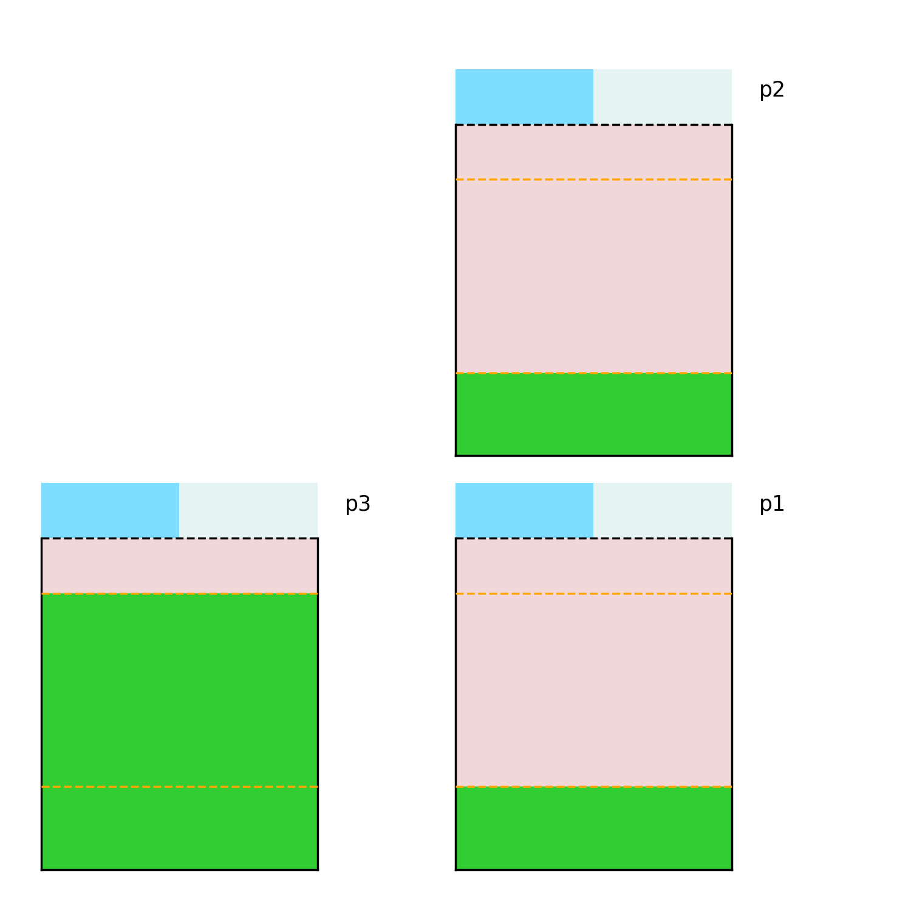

<b>Power Unit Commitmentn</b>

  

|       |      |
|:------------------|:------------|
| Import folder     | recsim.     |
| Action space      | Dict        |
| State space       | Dict        |

## Description
The recommender system maintains a limited inventory of items (say we can index/process so many items in a given day).
Providers compete for these slots, where the probability of a provider getting the slot is proportional to their satisfaction. 
Essentially, unsatisfied providers will become unrecommendable. Consumer satisfaction is according to the item features and the consumers affinity.
The goal of the recommander system is to maximize the consumer satifaction with the recommanded items.

## Action Space

There is a single type of action in this domain, a boolean decision, whether to recommand consumer *s* item *t*.

| Action               | type             |  Desc                          |
|:---------------------|:-----------------|:-------------------------------|
|  recommend(consumer, item)      | Discrete(2)  |  recommend one item to every consumer |

## State Space

The state is compriesed of the satisfaction level of the providers and consumers, and the all the item features.

| State                      | type              |  Desc                                   |
|:---------------------------|:------------------|:----------------------------------------|
|   provider-satisfaction(provider)     |  Box(1, np.float32)   |  consumer statisfaction level                 |
|   consumer-satisfaction(consumer)     |  Box(1, np.float32)   |  consumer statisfaction level                 |
|   item-feature(item, feature)         |  Box(1, np.float32)   |  how much of a feature is present in an item  |

## Rewards

The reward is a sum over all consumers statisfaction levels.

## References
- 

[Back to main page](index.md)
