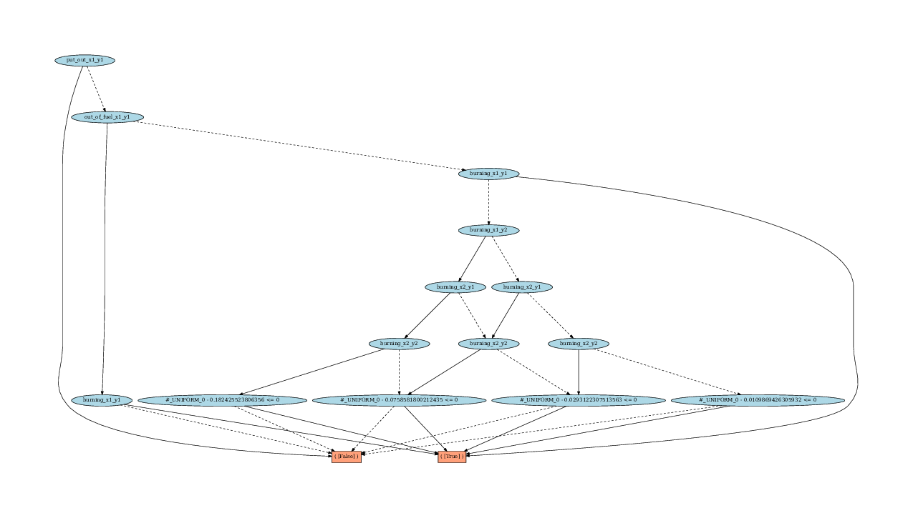
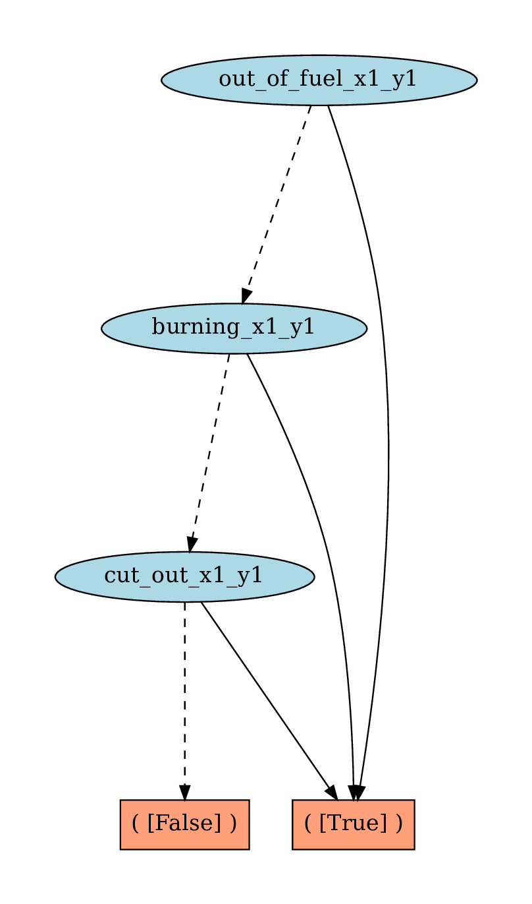

<p style="font-size:25px;text-align:left"><b>XADD Compilation of CPFs</b></p>

## Intro

XADD (eXtended Algebraic Decision Diagram) [Sanner at al., 2011] enables compact representation and operations with symbolic variables and functions. In fact, this data structure can be used to represent CPFs defined in a RDDL domain once it is grounded for a specific RDDL instance.

We use the [xaddpy](https://github.com/jihwan-jeong/xaddpy) package that provides a Pure Python implementation of XADD (originally implemented in Java). To install the package, simply run the following:

```shell
pip install xaddpy
```

## XADD compilation of the Wildfire domain

In this article, we are going to walk you through how you can use `xaddpy` to compile a CPF of a grounded fluent into an XADD node. 

For example, let's look at the [Wildfire](/wildfire.md) domain and the instance file provided [here](https://github.com/ataitler/pyRDDLGym/tree/main/pyRDDLGym/Examples/Wildfire/instance0.rddl) which has 3 x 3 locations.

<div style="width:100%;text-align:center;">
  <a href="images/wildfire_image.gif">
    
  </a>
</div>

Once the CPFs are grounded for this instance, we can see that the values of the non-fluents will simplify the CPFs. For instance, the neighboring cells of the `(x1, y1)` location are `(x1, y2)`, `(x2, y1)`, and `(x2, y2)`; hence, `burning'(x1, y1)` should only depend on the states of these neighbors --- plus `(x1, y1)` itself --- but none others. 

Once you compile the CPFs of this instance into an XADD, you can actually see this structure easily. In other words, XADD compilation reveals the DBN dependency structures of different variables, which we also explain in [a separate article](/dbn.md).

To run the XADD compilation, we first need to import the domain and instance files. Then, we instantiate the `RDDLModelXADD` class with the grounded CPFs given by the `RDDLGrounder` object.

Specifically, 

```python
from pyRDDLGym.Examples.ExampleManager import ExampleManager
from pyRDDLGym.Core.Grounder.RDDLGrounder import RDDLGrounder
from pyRDDLGym.XADD.RDDLModelXADD import RDDLModelWXADD
from pyRDDLGym.Core.Parser.RDDLReader import RDDLReader
from pyRDDLGym.Core.Parser.parser import RDDLParser

# Read the domain and instance files
domain, instance = 'Wildfire', '0'
env_info = ExampleManaget.GetEnvInfo(domain)
domain = env_info.get_domain()
instance = env_info.get_instance(instance)

# Read and parse domain and instance
reader = RDDLReader(domain, instance)
domain = reader.rddltxt
parser = RDDLParser(None, False)
parser.build()

# Parse RDDL file
rddl_ast = parser.parse(domain)

# Ground domain
grounder = RDDLGrounder(rddl_ast)
model = grounder.Ground()
```

From the last line, we get an instance of `pyRDDLGym.Core.Compiler.RDDLModel` class.  Then, we can instantiate a `pyRDDLGym.XADD.RDDLModelXADD` object: 

```python
# XADD compilation
model_xadd = RDDLModelWXADD(model)
model_xadd.compile()
```

When we call `model_xadd.compile()`, it will go through each and every CPF of the instance and convert the arithmetic/logical/stochastic/... expressions into an XADD node. Then, you can access the resulting nodes from `model_xadd.cpfs`, which is a dictionary that maps a grounded fluent name to the integer ID of the corresponding XADD node. 

You can print out the node if you do the following:

```python
cpf_burning_x1_y1 = model_xadd.cpfs["burning_x1_y1'"]
model_xadd.print(cpf_burning_x1_y1)
```

```
Output:

([put_out_x1_y1]
	 ( [False] )
	 ( [out_of_fuel_x1_y1]
		 ( [burning_x1_y1]
			 ( [True] )
			 ( [False] ))  
		 ( [burning_x1_y1]
			 ( [True] )
			 ( [burning_x1_y2]
				 ( [burning_x2_y1]
					 ( [burning_x2_y2]
						 ( [#_UNIFORM_0 - 0.182425523806356 <= 0]
							 ( [True] ) 
							 ( [False] ) )  
						 ( [#_UNIFORM_0 - 0.0758581800212435 <= 0]
							 ( [True] )
							 ( [False] ) )  )  
					 ( [burning_x2_y2]
						 ( [#_UNIFORM_0 - 0.0758581800212435 <= 0]
							 ( [True] )
							 ( [False] ) )  
						 ( [#_UNIFORM_0 - 0.0293122307513563 <= 0]
							 ( [True] )
							 ( [False] ) )  )  )  
				 ( [burning_x2_y1] 
					 ( [burning_x2_y2] 
						 ( [#_UNIFORM_0 - 0.0758581800212435 <= 0]
							 ( [True] )
							 ( [False] ) )  
						 ( [#_UNIFORM_0 - 0.0293122307513563 <= 0]
							 ( [True] )
							 ( [False] ) )  )  
					 ( [burning_x2_y2]
						 ( [#_UNIFORM_0 - 0.0293122307513563 <= 0]
							 ( [True] )
							 ( [False] ) )  
						 ( [#_UNIFORM_0 - 0.0109869426305932 <= 0]
							 ( [True] )
							 ( [False] )  )  )  )  )  )  )  )

```
Here, `#_UNIFORM_{number}` is a special variable that we have introduced to handle random variables. In the Wildfire domain, the burning event follows a Bernoulli distribution, which can be encoded with a random draw from `uniform(0, 1)` distribution.

A better way to interpret the resulting XADD may be to visualize it as a graph. 
You can do this by calling the `save_graph` method of the `XADD` object. 

```python
context = model_xadd._context   # The XADD object that stores all XADD nodes
context.save_graph(model_xadd.cpfs["burning_x1_y1'"], file_name="burning_x1_y1")
```

Here's the [result](/images/burning_x1_y1.pdf):

<div style="width:100%;text-align:center;">
  <a href="images/burning_x1_y1.png">
    
  </a>
</div>

If the figure is too small to comprehend, you can click the link above to check out the XADD graph. 

How will the graph look like for `out-of-fuel'(x1, y1)` variable? Here's the result of `context.save_graph(model_xadd.cpfs["out-of-fuel_x1_y1'"], file_name="out_of_fuel_x1_y1")`:

<div style="width:100%;text-align:center;">
  <a href="images/outoffuel_x1_y1.png">
    
  </a>
</div>


Very neat!

Now, you can go ahead and use this functionality to analyze a given RDDL instance.

<hr>
[Back to main page](index.md)
